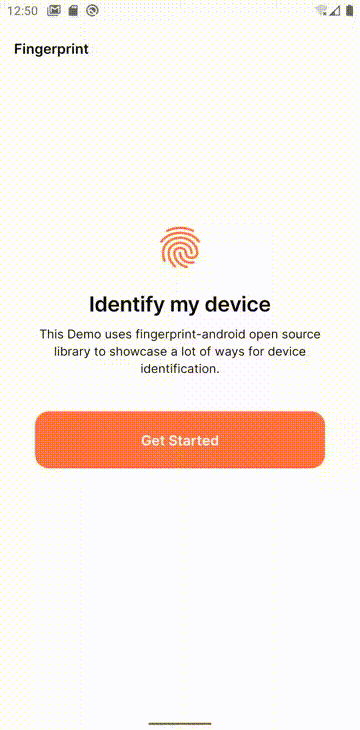
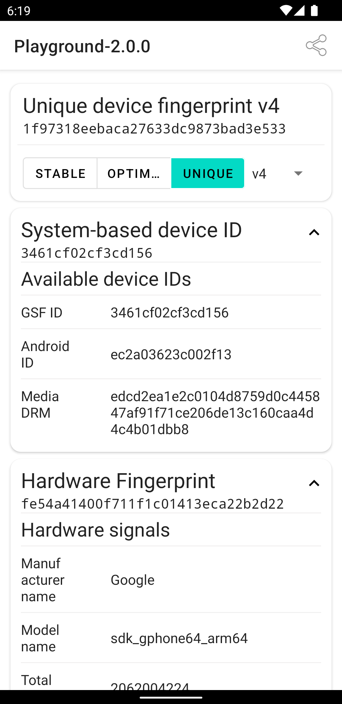
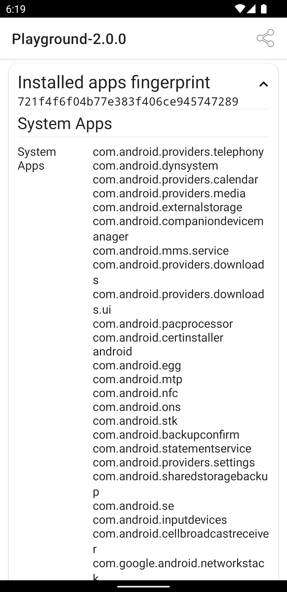
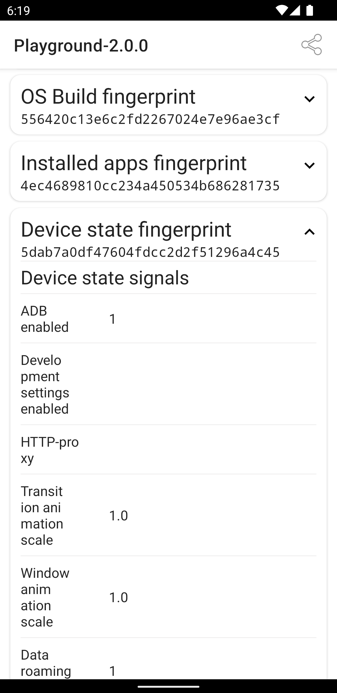

<p align="center">
    <picture>
      <source media="(prefers-color-scheme: dark)" srcset="resources/logo_light.svg" />
      <source media="(prefers-color-scheme: light)" srcset="resources/logo_dark.svg" />
      
    </picture>
</p>

<p align="center">
  <a href="https://jitpack.io/#fingerprintjs/fingerprint-android">
    
  </a>
  <a href="https://github.com/fingerprintjs/fingerprint-android/actions?workflow=Test">
    
  </a>
  <a href="https://android-arsenal.com/api?level=21">
    
  </a>
</p>

<p align="center">
  <a href="https://discord.gg/39EpE2neBg">
    
  </a>
</p>

<p align="center">
 	<a href='https://play.google.com/store/apps/details?id=com.fingerprintjs.android.playground'>
 		
 	</a>
 </p>
 
<p align="center"></p>

<p align="center">
  
  
  
  
</p>

# FingerprintJS Android

Lightweight library for device identification and fingerprinting.

Fully written in Kotlin. **100% Crash-free**.

Creates a device identifier from all available platform signals.

The identifier is fully stateless and will remain the same after reinstalling or clearing application data.

[Check the FingeprintJS iOS](https://github.com/fingerprintjs/fingerprintjs-ios) – an iOS library for device fingerprinting.

## Table of Contents
1. [Quick start](#quick-start)
2. [Usage](#3-get-deviceids-and-fingerprints)
3. [Playground App](#fingerprint-android-demo-app)


## Quick start

### 1. Add repository

Add these lines to your `build.gradle`.


```gradle
allprojects {	
  repositories {
  ...
  maven { url 'https://jitpack.io' }	
}}
```

### 2. Add dependency

Add this to a `build.gradle` of a module.

```gradle
dependencies {
  ...
  implementation "com.github.fingerprintjs:fingerprint-android:2.0.2"
}
```

Note that the library has the following runtime dependencies:
- [kotlin-stdlib](https://kotlinlang.org/api/latest/jvm/stdlib/)
- [androidx.appcompat](https://developer.android.com/jetpack/androidx/releases/appcompat)

### 3. Get deviceIDs and fingerprints

Kotlin

```kotlin

// Initialization
 val fingerprinter = FingerprinterFactory.create(context)

// Usage
fingerprinter.getFingerprint(version = Fingerprinter.Version.V_5) { fingerprint ->
    // Use fingerprint
}

fingerprinter.getDeviceId(version = Fingerprinter.Version.V_5) { result ->
    val deviceId = result.deviceId
    // Use deviceId
}

```

Java

```java

// Initialization
Fingerprinter fingerprinter = FingerprinterFactory.create(context);

// Usage
fingerprinter.getFingerprint(Fingerprinter.Version.V_5, fingerprint-> {
    // use fingerprint
    return null;
});

fingerprinter.getDeviceId(Fingerprinter.Version.V_5, deviceIdResult-> {
    String deviceId = deviceIdResult.getDeviceId();
    // use deviceId
    return null;
});

```

`getFingerprint` and `getDeviceId` methods execute on a worker thread, as well as the lambda you pass to them, so don't forget to post the work to the main thread when needed.

Also the results are cached, so subsequent calls will be faster.

#### deviceId vs fingerprint

The library operates with two entities.

1. `deviceId` - is a random and unique device identifier.

Can be used by developers to identify devices to deliver personalized content, detect suspicious activity, and perform fraud detection.
Internally it will use Google Service Framework ID, Media DRM ID or Android ID depending on which one is available.
This identifier is stable, i.e. it will remain the same even after reinstalling your app.
But it will be different after factory reset of the device.

2. `fingerprint` is a digital device fingerprint. It works by combining all available device signals and attributes into a single identifier. There is a probability that two identical devices will have the same `fingerprint`.


#### Which one should I use?

`deviceId` is guaranteed to be random and should be your first choice for device identification. This identifier can be spoofed though and shouldn't be used in security-focused or fraud detection scenarios.

`fingerprint` is much harder to spoof and is a safer choice in security-focused use cases.

See the [table](docs/stability.md) about stability of each.


## Versioning

`fingerprint` is versioned incrementally; the version should be set explicitly to avoid unexpected `fingerprint` changes when updating the library.

See full [API reference](docs/api_reference.md).

## Migration from 1.\*.\* library versions

The library API has undergone some changes in the major version 2. The older APIs are left as deprecated for now, but are planned to be removed in the future releases.
For the vast majority of library usage scenarios the migration process will be fast and almost effortless.

Check out [Migration to V2](docs/migration_to_v2.md) for migration steps and the motivation behind the changes to the API.

## Fingerprint Android Demo App

Try the library features in the [Fingerprint Android Demo App](https://github.com/fingerprintjs/fingerprintjs-android/releases/download/2.0.2/Playground-release-2.0.2.apk).

## Android API support

fingerprint-android supports API versions from 21 (Android 5.0) and higher.

## License

This library is MIT licensed.
Copyright FingerprintJS, Inc. 2020-2023.
