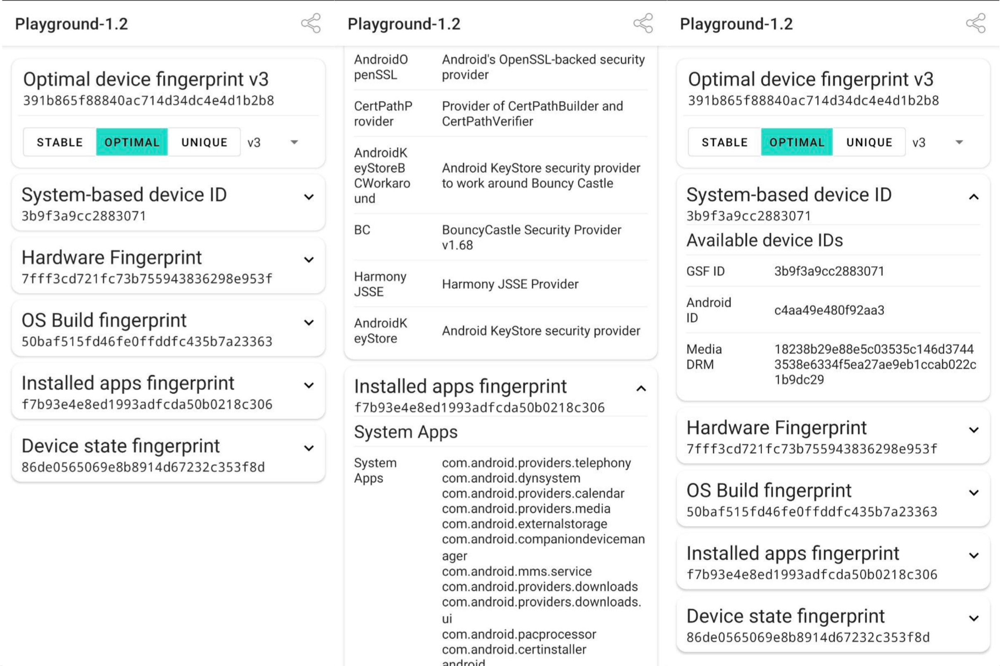

<p align="center">
  <a href="https://fingerprintjs.com">
    
  </a>
</p>

<p align="center">
  <a href="https://jitpack.io/#fingerprintjs/fingerprint-android">
    
  </a>
  <a href="https://github.com/fingerprintjs/fingerprint-android/actions?workflow=Test">
    
  </a>
  <a href="https://android-arsenal.com/api?level=21">
    
  </a>
</p>

<p align="center">
  <a href="https://discord.gg/39EpE2neBg">
    
  </a>
</p>

<p align="center">
    
</p>			

# fingerprint android

Lightweight library for device identification and fingerprinting.

Fully written in Kotlin. **100% Crash-free**. 

Creates a device identifier from all available platform signals.

The identifier is fully stateless and will remain the same after reinstalling or clearing application data.

## Table of Contents
1. [Quick start](#quick-start)
2. [Usage](#usage)
3. [Advanced usage](#advanced-usage)
4. [Playground App](#playground-app)


## Quick start

### Add repository

Add these lines to your `build.gradle`.


```gradle
allprojects {	
  repositories {
  ...
  maven { url 'https://jitpack.io' }	
}}
```

### Add dependency

Add these lines to `build.gradle` of a module.

This library depends on [kotlin-stdlib](https://kotlinlang.org/api/latest/jvm/stdlib/).

If your application is written in Java, add `kotlin-stdlib` dependency first (it's lightweight and has excellent backward and forward compatibility).

```gradle
dependencies {
  // Add this line only if you use this library with Java
  implementation "org.jetbrains.kotlin:kotlin-stdlib:$kotlin_version"

  implementation "com.github.fingerprintjs:fingerprint-android:1.2"
}


```


### deviceId vs fingerprint

The library operates with two entities. 

1. `deviceId` - is a unique device identifier.

Can be used by developers to identify devices to deliver personalized content, detect suspicious activity, and perform fraud detection.
Internally it will use Google Service Framework ID if it's available and ANDROID_ID, if GSF ID is not available. 
This identifier is stable, i.e. it will remain the same even after reinstalling your app. 
But it will be different after factory reset of the device.

2. `fingerprint` is a digital device fingerprint. It works by combining all available device signals and attributes into a single identifier. There is a probability that two identical devices will have the same `fingerprint`.


#### Which one should I use?

`deviceId` is guaranteed to be unique and should be your first choice for device identification. This identifier can be spoofed though and shouldn't be used in security-focused or fraud detection scenarios.

`fingerprint` is much harder to spoof and is a safer choice in security-focused use cases.


## Usage

Kotlin

```kotlin

// Initialization
 val fingerprinter = FingerprinterFactory
		.getInstance(applicationContext, Configuration(version = 3))


// Usage
fingerprinter.getFingerprint { fingerprintResult ->
  val fingerprint = fingerprintResult.fingerprint
}

fingerprinter.getDeviceId { result ->
  val deviceId = result.deviceId
}


```

Java

```java

// Initialization
Fingerprinter fingerprinter = FingerprinterFactory
				.getInstance(getApplicationContext(), new Configuration(3));


// Usage
fingerprinter.getFingerprint(new Function1<FingerprintResult, Unit>() {
        @Override
        public Unit invoke(FingerprintResult fingerprintResult) {
        	String fingerprint = fingerprintResult.getFingerprint();
        	    return null;
            }
        });
        
fingerprinter.getDeviceId(new Function1<DeviceIdResult, Unit>() {
            @Override
            public Unit invoke(DeviceIdResult deviceIdResult) {
            	String deviceId = deviceIdResult.getDeviceId();
                return null;
            }
        });

```

`getFingerprint` and `getDeviceId` methods execute on a separate thread. Keep this in mind when using results on the main thread.

Also the results are cached, so subsequent calls will be faster.

## Versioning

`fingerprint` is versioned incrementatlly; the version should be set explicitly to avoid unexpected `fingerprint` changes when updating the library.

The `version` is set while the initialization of the library with `Configuration` class.

```kotlin

val fingerprinter = FingerprinterFactory
		.getInstance(applicationContext, Configuration(version = 3))

```

## Advanced usage

Reference for Kotlin is provided below. [Java reference](docs/java_reference.md).

The full public API of the library is following:

```kotlin

interface Fingerprinter {
  fun getDeviceId(listener: (DeviceIdResult) -> (Unit))
  fun getFingerprint(listener: (FingerprintResult) -> (Unit))
  fun getFingerprint(stabilityLevel: StabilityLevel, listener: (FingerprintResult) -> (Unit))
}

interface FingerprintResult {
  val fingerprint: String
  fun <T> getSignalProvider(clazz: Class<T>): T?
}

data class DeviceIdResult(
  val deviceId: String,
  val gsfId: String?,
  val androidId: String,
  val mediaDrmId: String?
)

```

If you are using RxJava or Kotlin Coroutines - use the [extensions](docs/extensions.md).

### Increasing the uniqueness of fingerprints

There is a probability that two different devices will have the same `fingerprint` value. There is also a probability that the same device will have different `fingerprint` values in different moments of time due to system upgrades or updated settings (although this should be infrequent).

By default the library calculates a fingerprint with optimal stability and uniqueness. But also there are two more modes for fingerprints: Stable and Unique. 

Use them as shown below:


```kotlin


fingerprinter.getFingerprint(StabilityMode.STABLE) { fingerprintResult ->
  val stableFingerprint = fingerprintResult.fingerprint
}

fingerprinter.getFingerprint(StabilityMode.OPTIMAL) { fingerprintResult ->
  val optimalFingerprint = fingerprintResult.fingerprint
}

fingerprinter.getFingerprint(StabilityMode.UNIQUE) { fingerprintResult ->
  val uniqueFingerprint = fingerprintResult.fingerprint
}

``` 
 
### Raw data access

If you need access to raw data from signal providers, you can get it as shown below:

```kotlin

fingerprinter.getFingerprint { fingerprintResult ->

  val hardwareSignalProvider = fingerprintResult
  			.getSignalProvider(HardwareSignalGroupProvider::class.java)

  val hardwareFingerprint = hardwareSignalProvider.fingerprint()

  val cpuInfo = hardwareSignalProvider.rawData().procCpuInfo()
}

```

### Change hash function

The library uses [Murmur3 hash](https://en.wikipedia.org/wiki/MurmurHash) (64x128) which is fast and optimal for most cases.

If this hash function does not work for you, you can change it to a different one.

To do it, implement your own hasher, and pass it to `Configuration` class as shown below:

``` kotlin

val hasher = object : Hasher {
  override fun hash(data: String): String {
    // Implement your own hashing logic, e.g. call SHA256 here
  }
}

val fingerprinter = FingerprinterFactory.getInstance(
  applicationContext,
  Configuration(version = 1, hasher = hasher)

)

```

### Backward compatibility

If you want to get a newer version of fingerprint, but also want to keep the old one for backward compatibility, you can get them both as shown below:

```kotlin

val v1Fingerprinter = FingerprinterFactory
		.getInstance(applicationContext, Configuration(version = 1))

val v2Fingerprinter = FingerprinterFactory
		.getInstance(applicationContext, Configuration(version = 2))


v1Fingerprinter.getFingerprint { fingerprintResult ->
  val v1Fingerprint = fingerprintResult.fingerprint
}

v2Fingerprinter.getFingerprint { fingerprintResult ->
  val v2Fingerprint = fingerprintResult.fingerprint
}

```

## Playground App

Try all the library features in the [Playground App](https://github.com/fingerprintjs/fingerprint-android/releases/download/1.2/Playground-release-1.2.apk).


<p align="center">
  <a href="https://github.com/fingerprintjs/fingerprint-android/releases/download/1.2/Playground-release-1.2.apk">
    
   </a>
</p>			

## Android API support

fingerprint-android supports API versions from 21 (Android 5.0) and higher.


## Contributing
Feel free to ask questions and request features.
Just create an issue with a clear explanation of what you'd like to have in the library.
For code contributions, please see the [contributing guideline](docs/contributing.md).

## Testimonials

>Just tested on HUAWEI Y6p, with factory reset, we can retrieve the same result with `StabilityLevel.STABLE` setting.
>
>Thank you
>
> **_GitHub user_**

## License

This library is MIT licensed.
Copyright FingerprintJS, Inc. 2020-2021.

